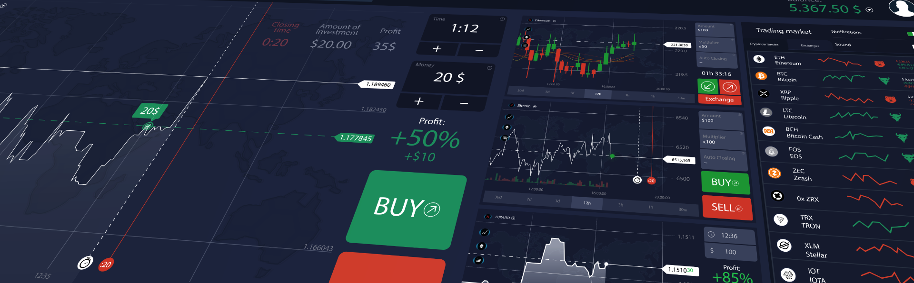
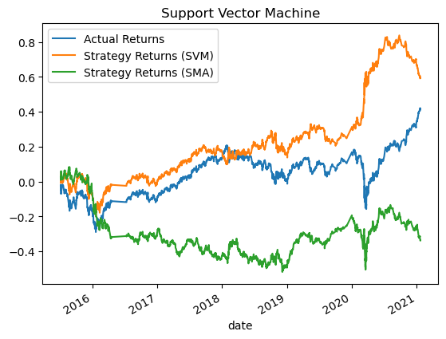
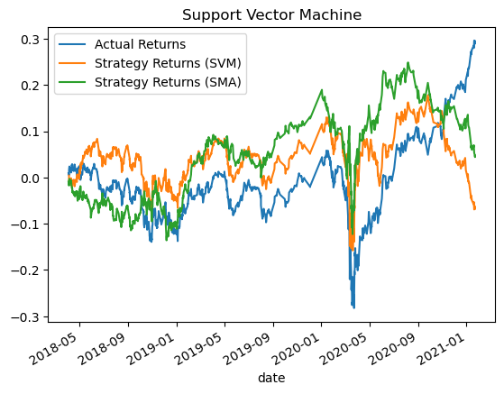
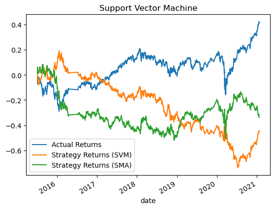
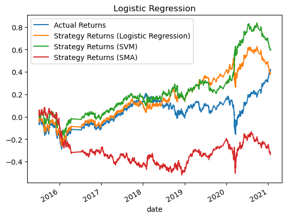

# Machine Learning Trading Bot Evaluation Report

### Establish a Baseline Performance

We set up SKLearn's support vector machine (SVM) learning method using the SVC classifier model to test and train our data.  

For our training and testing inputs (X) we use simple moving averages (SMA) of 4 and 100 days.  For our training and testing outputs we use a buy signal when actual daily returns are positive and sell signal when they are negative.  Our training data is three months and our testing data is around 5.5 years. 

We are using a rather simple inputs and output signal with a small training window, so we are not predicting great results.

Our classification report gives us:
* Accuracy is 0.52.  
* Sell Precision 0.45
* Sell Recall 0.39
* Buy Precision 0.56
* Buy Recall 0.62

The accuracy is around a half, so it is basically flipping a coin.  These two approachs SMA and SVM are not predicting the same thing at all.

Plotting the Actual Returns versus the Strategy Returns we see a similiar patterns with the Strategy Returns doing better than the actual returns.

For most of the time the SVM approach did better than the actual returns and did much better than the SMA approach.

### Tune the Baseline Trading Algorithm - Increase Training

Next we will tune the results by increasing the training period from 3 months to 36 months.

Our classification report gives us:
* Accuracy is 0.52.  
* Sell Precision 0.44
* Sell Recall 0.23
* Buy Precision 0.55
* Buy Recall 0.76

This is similar to the 3 month training results.  The accuracy is around a half, so it is basically flipping a coin.  These two approachs SMA and SVM are not predicting the same thing at all.

Here the SVM approach with 36 months did worse than it did with 3 months training.

### Tune the Baseline Trading Algorithm - Increase Fast Window

Our next tuning is increasing our fast rolling average from 4 days to 50 days.

Our classification report gives us:
* Accuracy is 0.49.  
* Sell Precision 0.44
* Sell Recall 0.57
* Buy Precision 0.55
* Buy Recall 0.42

This is slightly worse than the 4 day rolling fast window.  The accuracy is around a half, so it is basically flipping a coin.  These two approachs SMA and SVM are not predicting the same thing at all.

This is the worse performing SVM approach so far.  It even performs worse that the SMA approach.

### Evaluate a New Machine Learning Classifier

Our next model resets the parameters back to first model (3 months training and 4 day fast rolling window), but now instead of using the SVM we will be using the Logistic Regression model.

Our classification report is: 
* Accuracy is 0.52.  
* Sell Precision 0.44
* Sell Recall 0.33
* Buy Precision 0.56
* Buy Recall 0.66

Again, the accuracy is around a half, so it is basically flipping a coin.  These two approachs SMA and Logistic Regression models are not predicting the same thing at all.

Here for most of the time it is performing better than the actual returns, but it falls below it right at the end.  It was doing well and even starting to be better than the SVM approach until Covid hit where it fell.

### Conclusion

The Simple Moving Average apprach was the worse performing approach. The other models which used that as its signal didn't particularly continue using it in its predictions.  The for the most part both the logistic regression and SVM model outperformed the actual returns.  The main different is that the SVM approach went up during the initial covid global shutdown whereas the other approaches went down.  This gives the SVM an edge over the hold positions (Actual Returns) and the SVM approach.

